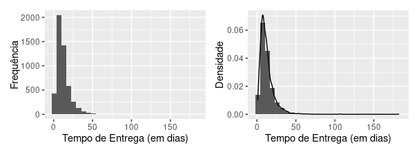
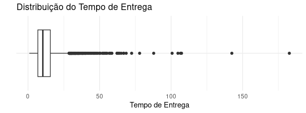

# 📦 Inferência estatística sobre o tempo médio de entrega em pedidos de e-commerce no Brasil

Análise inferencial do tempo de entrega de pedidos de e-commerce no Brasil,
utilizando dados reais da Olist.


---

# 🎯 Objetivo geral

Analisar, por meio de técnicas de inferência estatística, o tempo médio de entrega de pedidos de e-commerce no Brasil, utilizando dados reais da Olist referentes a pedidos efetivamente entregues.

### 🎯 Objetivos específicos: 

- Construir a variável tempo de entrega, em dias, a partir das datas de compra e entrega dos pedidos.
- Realizar uma análise descritiva do tempo de entrega.
- Estimar o tempo médio de entrega por meio de intervalos de confiança.
- Testar hipóteses sobre a média populacional do tempo de entrega.
- Conclusão do Projeto.
--- 

# 🗂️ Dados
- Fonte: https://www.kaggle.com/datasets/olistbr/brazilian-ecommerce?resource=download&select=olist_orders_dataset.csv
- Conjunto: `orders`
- Amostragem aleatória simples (n = 5.000)
- Código do Projeto: `inferencia_ecommerce.R`

# 1️⃣ Passo 1 — Construir a variável tempo de entrega, em dias, a partir das datas de compra e entrega dos pedidos.

#### Importante ressaltar que foi usado na análise apenas os pedidos com status delivered, uma vez que apenas nesses casos o tempo de entrega pode ser observado. Pedidos com status shipped, invoiced, unavailable etc foram excluídos da observação.

```R

# 1.1 - Importado o dataset

# Carregando as bibliotecas necessárias 

library(dplyr)
library(readr)

# Armazenando o dataset no objeto pedidos_olist

pedidos_olist = read.csv(file = "olist_orders_dataset.csv")

# 1.2 - Filtrando apenas os pedidos com status delivered:

pedidos_entregues = olist_orders_dataset %>%
  filter(order_status == "delivered")

# 1.3 - Visualizando as 5 primeiras linhas do dataset

View(pedidos_entregues)

```
| # | order_id | customer_id | order_status | order_purchase_timestamp | order_approved_at | order_delivered_carrier_date | order_delivered_customer_date | order_estimated_delivery_date |
|---|----------|-------------|--------------|---------------------------|-------------------|------------------------------|-------------------------------|-------------------------------|
| 1 | e481f51cbdc54678b7cc49136f2d6af7 | 9ef432eb6251297304e76186b10a928d | delivered | 2017-10-02 10:56:33 | 2017-10-02 11:07:15 | 2017-10-04 19:55:00 | 2017-10-10 21:25:13 | 2017-10-18 |
| 2 | 53cdb2fc8bc7dce0b6741e2150273451 | b0830fb4747a6c6d20dea0b8c802d7ef | delivered | 2018-07-24 20:41:37 | 2018-07-26 03:24:27 | 2018-07-26 14:31:00 | 2018-08-07 15:27:45 | 2018-08-13 |
| 3 | 47770eb9100c2d0c44946d9cf07ec65d | 41ce2a54c0b03bf3443c3d931a367089 | delivered | 2018-08-08 08:38:49 | 2018-08-08 08:55:23 | 2018-08-08 13:50:00 | 2018-08-17 18:06:29 | 2018-09-04 |
| 4 | 949d5b44dbf5de918fe9c16f97b45f8a | f88197465ea7920adcdbec7375364d82 | delivered | 2017-11-18 19:28:06 | 2017-11-18 19:45:59 | 2017-11-22 13:39:59 | 2017-12-02 00:28:42 | 2017-12-15 |
| 5 | ad21c59c0840e6cb83a9ceb5573f8159 | 8ab97904e6daea8866dbdbc4fb7aad2c | delivered | 2018-02-13 21:18:39 | 2018-02-13 22:20:29 | 2018-02-14 19:46:34 | 2018-02-16 18:17:02 | 2018-02-26 |

```R

# 1.3 Convertendo as datas

pedidos_entregues$order_purchase_timestamp = as.POSIXct(
  pedidos_entregues$order_purchase_timestamp,
  format = "%Y-%m-%d %H:%M:%S",
  tz = "UTC"
)

pedidos_entregues$order_delivered_customer_date = as.POSIXct(
  pedidos_entregues$order_delivered_customer_date,
  format = "%Y-%m-%d %H:%M:%S",
  tz = "UTC"
)

#1.4 - Criando a variável tempo de entrega (em dias)

pedidos_entregues$tempo_entrega = as.numeric(
  difftime(
    pedidos_entregues$order_delivered_customer_date,
    pedidos_entregues$order_purchase_timestamp,
    units = "days"
  )
)

#1.5 Visualizando as 5 primeiras linhas do dataset com a variável tempo de entrega criada

head(pedidos_entregues)

```

| # | order_id | customer_id | order_status | order_purchase_timestamp | order_approved_at | order_delivered_carrier_date | order_delivered_customer_date | order_estimated_delivery_date | tempo_entrega |
|---|----------|-------------|--------------|---------------------------|-------------------|------------------------------|-------------------------------|-------------------------------|---------------|
| 1 | e481f51cbdc54678b7cc49136f2d6af7 | 9ef432eb6251297304e76186b10a928d | delivered | 2017-10-02 10:56:33 | 2017-10-02 11:07:15 | 2017-10-04 19:55:00 | 2017-10-10 21:25:13 | 2017-10-18 | 8.436574 |
| 2 | 53cdb2fc8bc7dce0b6741e2150273451 | b0830fb4747a6c6d20dea0b8c802d7ef | delivered | 2018-07-24 20:41:37 | 2018-07-26 03:24:27 | 2018-07-26 14:31:00 | 2018-08-07 15:27:45 | 2018-08-13 | 13.782037 |
| 3 | 47770eb9100c2d0c44946d9cf07ec65d | 41ce2a54c0b03bf3443c3d931a367089 | delivered | 2018-08-08 08:38:49 | 2018-08-08 08:55:23 | 2018-08-08 13:50:00 | 2018-08-17 18:06:29 | 2018-09-04 | 9.394213 |
| 4 | 949d5b44dbf5de918fe9c16f97b45f8a | f88197465ea7920adcdbec7375364d82 | delivered | 2017-11-18 19:28:06 | 2017-11-18 19:45:59 | 2017-11-22 13:39:59 | 2017-12-02 00:28:42 | 2017-12-15 | 13.208750 |
| 5 | ad21c59c0840e6cb83a9ceb5573f8159 | 8ab97904e6daea8866dbdbc4fb7aad2c | delivered | 2018-02-13 21:18:39 | 2018-02-13 22:20:29 | 2018-02-14 19:46:34 | 2018-02-16 18:17:02 | 2018-02-26 | 2.873877 |

# 2️⃣ Passo 2 - Amostragem por aleatoriedade

#### Considerando o tamanho elevado da base de dados, foi selecionada uma amostra aleatória simples com tamanho suficiente (n = 5000) para garantir estabilidade das estimativas e viabilizar a aplicação dos métodos inferenciais, conforme o Teorema Central do Limite.

```R 
# 2.1 - Fixando a semente 

set.seed(123)

# 2.2 - Tamanho da amostra 

n = 5000

# 2.3 - Amostragem aleatória simples

amostra_pedidos_entregues = pedidos_entregues[
  sample(seq_len(nrow(pedidos_entregues)), size = n, replace = FALSE),]

```

# 3️⃣ Passo 3 - Análise descritiva da variável `tempo_entrega`

```R 

# 3.1 - Medidas resumo da variável

summary(amostra_pedidos_entregues$tempo_entrega)

# 3.1.1 - Desvio padrão e variância da variável tempo de entrega

# Desvio Padrão 

sd(amostra_pedidos_entregues$tempo_entrega)

# Variância 

var(amostra_pedidos_entregues$tempo_entrega)

```
## Medidas Descritivas da variável `tempo_entrega`
| Medida            | Valor    |
|-------------------|----------|
| Mínimo            | 0.8908   |
| 1º Quartil (Q1)   | 6.8602   |
| Mediana           | 10.3555  |
| Média             | 12.6524  |
| 3º Quartil (Q3)   | 15.5935  |
| Máximo            | 182.6581 |
| Desvio-padrão     | 9.6977   |
| Variância         | 94.0446  |

### Observações:
- Média > mediana: distribuição assimétrica a direita.
- Máximo muito alto: possíveis falhas logísticas, dificuldades de acesso, distância geográfica, pedido extraviado etc.

## Visualização da distribuição através de histograma e boxplot
```R
# Instalando e carregando as bibliotecas necessarias para plotar os gráficos

install.packages("patchwork")
library(patchwork)
install.packages("ggplot2")
library(ggplot2)

# Histograma 1

histograma_1 = ggplot(amostra_pedidos_entregues, aes(x = tempo_entrega)) +
  geom_histogram(bins = 30) +
  labs(
    tittle = "Dostribuição do Tempo de Entrega",
    x = "Tempo de Entrega (em dias)",
    y = "Frequência"
  )
  theme_minimal()

# Histograma 2
  
histograma_2 = ggplot(amostra_pedidos_entregues, aes(x = tempo_entrega)) + 
  geom_histogram(aes(y = ..density..), bins = 30) +
  geom_density() + 
  labs(
    tittle = "Dostribuição do Tempo de Entrega",
    x = "Tempo de Entrega (em dias)",
    y = "Densidade"
  )
theme_minimal()

histograma_1 | histograma_2

```

- Observa-se a existência de uma cauda longa à direita, indicando que uma parcela dos pedidos enfrenta atrasos significativos, o que pode impactar negativamente a percepção de qualidade do serviço logístico.
---

```R
# Box Plot
  
ggplot(amostra_pedidos_entregues, aes(x = "", y = tempo_entrega)) +
  geom_boxplot() +
  coord_flip() +
  labs(
    title = "Distribuição do Tempo de Entrega",
    y = "Tempo de Entrega",
    x = ""
    ) +
  theme_minimal()
```

- Observa-se a presença de outliers no limite superior do gráfico, evidenciando pedidos com longos atrasos.

# 4️⃣ Passo 4 - Estimar o tempo médio de entrega por meio de intervalos de confiança.

```R

# 4.1 Intervalo de Confiança para a média 

x_barra = mean(amostra_pedidos_entregues$tempo_entrega)
s = sd(amostra_pedidos_entregues$tempo_entrega)
n = length(amostra_pedidos_entregues$tempo_entrega)

erro_padrao = s / sqrt(n)
t_critico = qt(0.975, df = n - 1)

IC <- c(
  x_barra - t_critico * erro_padrao,
  x_barra + t_critico * erro_padrao)

IC

```

- Com 95% de confiança o IC indica que a média populacional do tempo de entrega está entre 12.38 e 12.92 dias;
- Embora existam pedidos individuais com tempos de entrega bastante elevados, inclusive superiores a 100 dias, isso não contradiz os limites do intervalo de confiança, uma vez que este se refere exclusivamente à média populacional do tempo de entrega e não aos valores individuais da variável.

# 5️⃣ Passo 5 - Conclusão do Projeto.

Este projeto teve como objetivo analisar o tempo de entrega de pedidos, utilizando inferência estatística aplicadas a dados reais. A partir do conjunto de dados `orders`, realizou-se inicialmente o tratamento dos dados, incluindo a seleção de pedidos entregues, a verificação de valores ausentes e a criação da variável tempo de entrega, calculada como a diferença entre a data de compra e a data de entrega ao cliente.

Com o intuito de garantir a validade dos procedimentos inferenciais, foi realizada uma análise exploratória dos dados por meio de gráficos descritivos, como histogramas e boxplot. Observou-se a presença de assimetria à direita e valores extremos.

A inferência estatística foi conduzida por meio da estimação de um intervalo de confiança de 95% para a média populacional do tempo de entrega, o qual resultou em um intervalo aproximadamente entre 12.38 e 12.92 dias.

Os resultados sugerem que o desempenho médio de entrega é satisfatório, embora a presença de uma cauda longa na distribuição do tempo de entrega indique a existência de uma pequena parcela de pedidos com atrasos expressivos, os quais podem impactar negativamente a percepção do nível de serviço. Dessa forma, a análise evidencia a importância de se monitorar não apenas a média dos prazos de entrega, mas também a variabilidade e os casos extremos, a fim de aprimorar a eficiência e a confiabilidade do processo logístico.